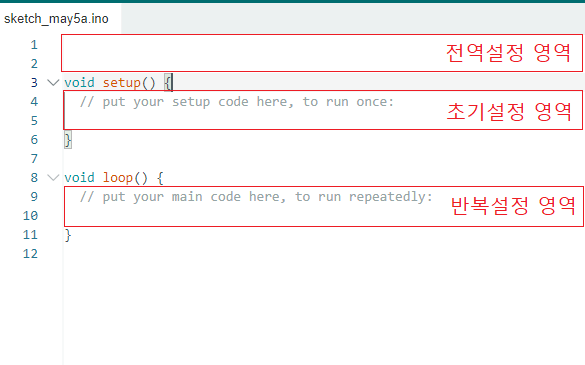
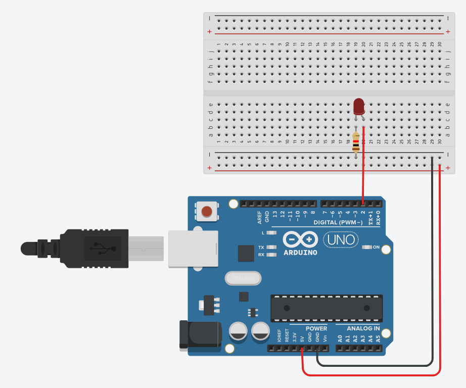
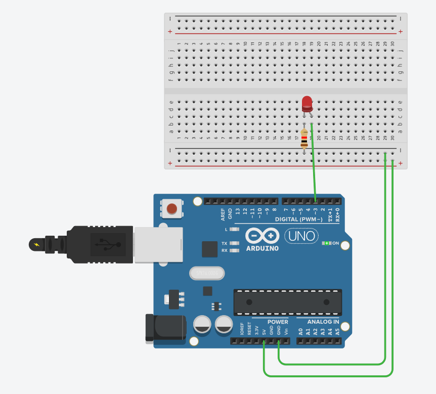
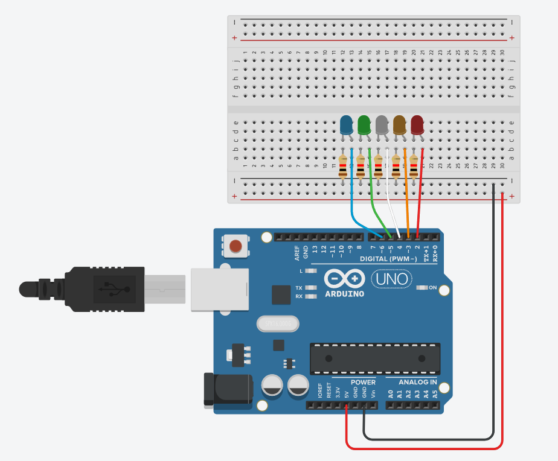
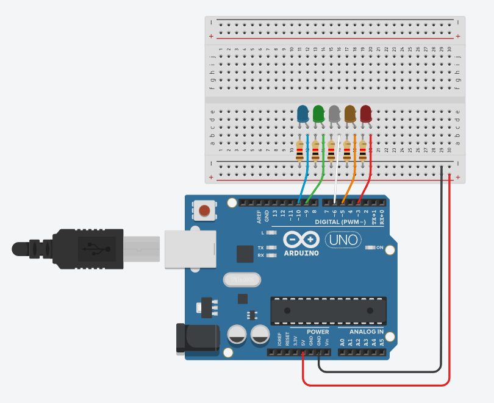

# 아두이노 우노 실습하기


사전확인
---
> EDIDTOR <br>

|-|
|-|
||
|-|

> 사용함수 정리 <br>

|-|-|
|-|-|
|Serial.begin<br>(unsigned long baudrate);|	시리얼 통신을 초기화하는 함수<br>baudrate : 통신 속도를 나타내는 매개변수로, 통신할 장치 간의 데이터 전송 속도를 설정<br>일반적으로 사용되는 값은 300, 1200, 2400, 4800, 9600, 14400, 19200, 28800, 38400, 57600, 또는 115200<br>이 값은 비트 속도 (bps, bits per second 를 나타냅니다.|
|pinMode<br>(pin, mode)|해당 핀의 입출력 모드를 설정합니다. pin은 설정하려는 핀의 번호이고, mode는 입력(INPUT) 또는 출력(OUTPUT) 중 하나입니다.|
|digitalWrite(pin, value)|디지털 출력을 설정합니다. pin은 출력을 설정할 핀의 번호이고, value는 설정할 값으로 LOW(0) 또는 HIGH(1) 중 하나입니다.|
|digitalRead(pin)|디지털 입력을 읽어옵니다. pin은 읽어올 핀의 번호입니다. 입력이 LOW(0)이면 0을, HIGH(1)이면 1을 반환합니다.|
|analogWrite(pin, value)|아날로그 출력을 설정합니다.<br>pin은 출력을 설정할 핀의 번호이고, value는 설정할 값으로 0(0%)에서 255(100%)까지의 값을 가집니다.<br>해당 함수는 PWM (Pulse Width Modulation) 신호를 생성하여 아날로그적인 출력을 시뮬레이션합니다.|
|analogRead(pin)|아날로그 입력 값을 읽어옵니다.<br>pin은 읽어올 핀의 아날로그 번호(0부터 5까지)입니다.<br>반환값은 0에서 1023 사이의 값으로, 아날로그 입력 전압을 디지털 값으로 변환하여 제공합니다|
|delay(milliseconds)|프로그램 실행을 지정된 밀리초(1/1000초) 동안 일시 정지합니다.<br> 예를 들어, delay(1000)은 1초 동안 프로그램 실행을 멈춥니다.|
|millis()|아두이노 보드가 실행된 후 경과한 밀리초 단위의 시간을 반환합니다.<br> 이는 delay() 함수 없이도 일정 시간이 경과했는지 확인하는 데 사용될 수 있습니다.|
|micros()|아두이노 보드가 실행된 후 경과한 마이크로초 단위의 시간을 반환합니다.<br>이 또한 일정 시간이 경과했는지 확인하는 데 사용될 수 있습니다.|
|Serial.begin(baudrate)|시리얼 통신을 초기화합니다. baudrate는 통신 속도를 나타냅니다.<br>이 함수를 사용하여 컴퓨터와 아두이노 간의 시리얼 통신을 설정할 수 있습니다.|
|Serial.print(data) <br> Serial.println(data):|시리얼 모니터로 데이터를 보냅니다.<br>data는 보낼 데이터이고, println()은 데이터 뒤에 줄 바꿈 문자를 추가하여 출력합니다.|


> 따라해보기<br>

```
void setup() {
  Serial.begin(9600);
  Serial.println("SETUP FUNCTION..");
  delay(1000);
}
void loop() {
   Serial.println("[Loop] HELLOWORLD");
   delay(1000);
}
```

---
#
---

LED 점등실습-01(디지털)
---
> 그림 <br>

|-|
|-:|
| |
|[바로가기-시뮬레이터](https://www.tinkercad.com/things/7hG3uHjqq5y-led-01?sharecode=8ZboE8SFsWNvcxJhP5Elq_7MJDO3u65oWl48yYvu5yQ)|

> 예제 1 DigitalWrite() <br>

```
const unsigned int pinNo = 2;

void setup()
{
   pinMode(pinNo,OUTPUT);
}

void loop()
{
	digitalWrite(pinNo, HIGH);
}
```

> 예제 2 DigitalWrite()<br>

```
const unsigned int pinNo = 2;

void setup()
{
   pinMode(pinNo,OUTPUT);
}
void loop()
{ 
  	delay(500);
	digitalWrite(pinNo, HIGH);
  	delay(500);
	digitalWrite(pinNo, LOW);
}
```


---
#
---

LED 점등실습-02(아날로그)
---
>  <br>

|-|
|-:|
||
|[바로가기-시뮬레이터](https://www.tinkercad.com/things/6ynEMLKTIpW-led-02?sharecode=lnyA5xWVZnRQS8cYAfHyU9gNBGNZciFeFtu3Y5yH668)|

```
const unsigned int AnalogPin=3;

void setup() {
  pinMode(AnalogPin,OUTPUT);
}
void loop() {
	for(int i=0;i<=255;i++)
	{
        	analogWrite(AnalogPin,i);
		delay(10);
   	}
  	//analogWrite(AnalogPin,0);
  
  	for(int i=255;i>=0;i--)
    	{
        	analogWrite(AnalogPin,i);
		delay(10);
    	}	
}
```

---
#
---

LED 점등실습-03(디지털)
---
>  <br>

|-|
|-:|
| |
|[바로가기-시뮬레이터](https://www.tinkercad.com/things/hM41NEIwThZ-led-03?sharecode=My3keytqNlIphL6EeDeDNpol_kgyN_e6flSmUf5kj44)|

```
const unsigned int led[5] = {2,3,4,5,6};

void setup() {
  for(int x=0 ; x<5 ; x++){
    pinMode(led[x],OUTPUT);
  }
}
void loop() {
  for(int i=0;i<5;i++){  
      //ALL OFF
      for(int x=0;x<=5;x++){
        digitalWrite(led[x],LOW);
      }  
      digitalWrite(led[i], HIGH);
      delay(500);
  }
}
```

---
#
---

LED 점등실습-04(아날로그)
---
>  <br>

|-|
|-:|
||
|[바로가기-시뮬레이터](https://www.tinkercad.com/things/akqGO2NH2xY-led-04?sharecode=XeMAN3-tNhbaEC2c1nQH_jWuJaZ312uVC2yZzTJZXF0)|


> 기본예제 <br>

```
const unsigned int led[5] = {3,5,6,9,10};

void setup() {
  
}
void loop() {
  
	for(int i=0;i<=255;i++)
    	{
	        analogWrite(led[0],i);
		delay(5);
    	}
 	analogWrite(led[0],0);
  	for(int i=0;i<=255;i++)
    	{
        	analogWrite(led[1],i);
		delay(5);
   	 }
 	analogWrite(led[1],0);
  	for(int i=0;i<=255;i++)
    	{
		analogWrite(led[2],i);
		delay(5);
    	}
 	analogWrite(led[2],0);
  	for(int i=0;i<=255;i++)
    	{
        	analogWrite(led[3],i);
		delay(5);
    	}
 	analogWrite(led[3],0);
  	for(int i=0;i<=255;i++)
    	{
        	analogWrite(led[4],i);
		delay(5);
    	}
 	analogWrite(led[4],0);
}
```

> 또는 <br>
```
const unsigned int led[5] = {3,5,6,9,10};

void setup() {
  
}
void loop() {
  
  for(int i=0;i<5;i++)
  {
	for(int led_high=0;led_high<=255;led_high++)
    	{
        	analogWrite(led[i],led_high);
		delay(5);
    	}
 	analogWrite(led[i],0);
  }
}
```


