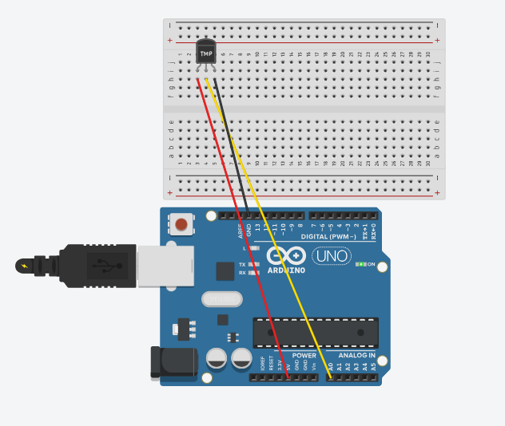

# 모듈 테스트

조도센서
---
> - <br>

|-|
|-|
||
|OR|
||

```
const int analogPin = A0;
const int ledPin = 10;
void setup()
{
 Serial.begin(115200);
}
void loop()
{
  int analogValue = analogRead(analogPin);
  
  Serial.println(analogValue);
  analogWrite(ledPin, analogValue/4);
  delay(100);

}
```

---
#
---


초음파센서
---
> 초음파센서_01 <br>

|-|
|-|
||
|or|
||

```
const int trig_pin = 11;
const int echo_pin = 12;

void setup()
{
 Serial.begin(115200);
 pinMode(trig_pin,OUTPUT);
 pinMode(echo_pin,INPUT);
}

void loop()
{
  digitalWrite(trig_pin,LOW);
  delayMicroseconds(2);
  digitalWrite(trig_pin,HIGH);
  delayMicroseconds(10);
  digitalWrite(trig_pin,LOW);

  long duration = pulseIn(echo_pin,HIGH);
  long distance = (duration/2)/29.1;

  Serial.print(distance);
  Serial.println(" cm");
  delay(100);
}
```


> 초음파센서_02<br>

|-|
|-|
||
|OR|
||

```
const int trig_pin = 11;
const int echo_pin = 12;

int LED1 = 4;       
int LED2 = 7;     
int LED3 = 8;
void setup()
{
 Serial.begin(115200);
 pinMode(trig_pin,OUTPUT);
 pinMode(echo_pin,INPUT);

  pinMode(LED1, OUTPUT);     
  pinMode(LED2, OUTPUT);
  pinMode(LED3, OUTPUT);
}

void loop()
{
  digitalWrite(trig_pin,LOW);
  delayMicroseconds(2);
  digitalWrite(trig_pin,HIGH);
  delayMicroseconds(10);
  digitalWrite(trig_pin,LOW);

  long duration = pulseIn(echo_pin,HIGH);
  long distance = (duration/2)/29.1;

  Serial.print(distance);
  Serial.println(" cm");
  delay(100);

  if (distance > 30)  //   distance(거리) 가 80보다 크면
  {
    digitalWrite(LED1, HIGH);     // GREEN이 연결된 핀에 HIGH 신호(5V)를,
    digitalWrite(LED2, LOW);    // YELLOW가 연결된 핀에 LOW 신호(0V)를,
    digitalWrite(LED3, LOW);       // RED가 연결된 핀에 LOW신호(0V)를.
  }
  if (distance > 15 & distance <= 30)  
  {
    digitalWrite(LED1, LOW);   
    digitalWrite(LED2, HIGH);
    digitalWrite(LED3, LOW);
  }
  if (distance > 0 & distance <= 15)
  {
    digitalWrite(LED1, LOW);
    digitalWrite(LED2, LOW);
    digitalWrite(LED3, HIGH);
  }

}
```

---
#
---

온도센서
---
> 온도센서 <br>

|-|
|-|
||

```
float temp;
 
void setup() {
  Serial.begin(9600);
}
 
void loop() {
  int val = analogRead(A0);
  temp = val*0.48828125; //화씨 → 섭씨 변경
  Serial.print("Current Temperature : ");
  Serial.println(temp);
  delay(500);
}

```
