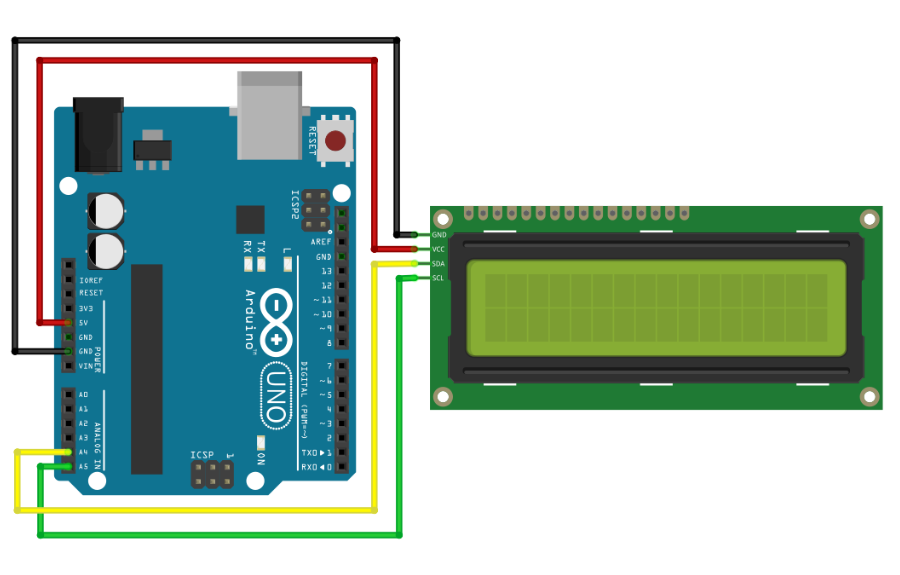
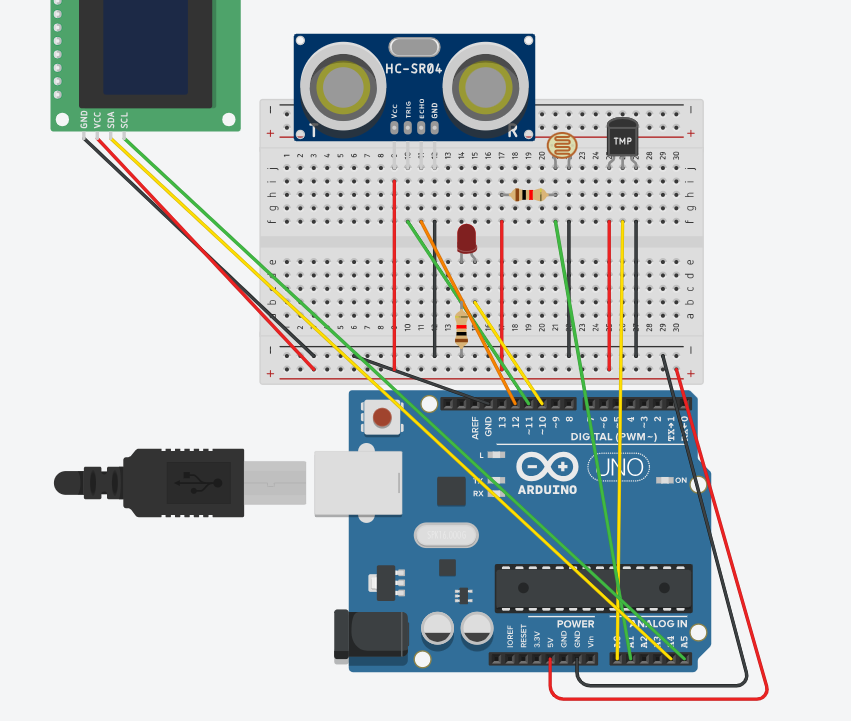

# 모듈 테스트

LCD DISPLAY
---
> 참고 <br>

|-|
|-|
|[LCD DISPLAY](https://copynull.tistory.com/381)|


> 능동부저 기본 <br>

|-|
|-|
||

```
#include <LiquidCrystal_I2C.h>

LiquidCrystal_I2C lcd(0x27,16,2);

void setup() {
  lcd.init();
  lcd.backlight();
  
}

void loop() {
    lcd.setCursor(2,0);
    lcd.print("HELLO WORLD!");

    lcd.setCursor(2, 1);
    lcd.print("- copynull -");

}

```


> LCD_ETC_SENSOR <br>

|-|
|-|
||

```
#include <LiquidCrystal_I2C.h>

//LCD
LiquidCrystal_I2C lcd(0x27,16,2);


//온도
float temp;

//조도
const int analogPin = A1;
const int ledPin = 10;

//초음파
const int trig_pin = 11;
const int echo_pin = 12;

void setup() {
  Serial.begin(9600);

  //초음파
  pinMode(trig_pin,OUTPUT);
  pinMode(echo_pin,INPUT);

  //LCD
  lcd.init();
  lcd.backlight();

}
 
void loop() {

  //조도
  int analogValue = analogRead(analogPin);
  Serial.print("Current Light Value : ");
  Serial.print(analogValue);
  analogWrite(ledPin, analogValue/4);

  //온도
  int val = analogRead(A0);
  temp = val*0.48828125; //화씨 → 섭씨 변경
  Serial.print("  Current Temperature : ");
  Serial.print(temp);

  //초음파
  digitalWrite(trig_pin,LOW);
  delayMicroseconds(2);
  digitalWrite(trig_pin,HIGH);
  delayMicroseconds(10);
  digitalWrite(trig_pin,LOW);

  long duration = pulseIn(echo_pin,HIGH);
  long distance = (duration/2)/29.1;

  Serial.print("  Distance : ");
  Serial.print(distance);
  Serial.println(" cm");


  //LCD
  lcd.setCursor(2,0);
  lcd.print(distance);
  lcd.print("cm tmp:");
  lcd.print(temp);

  lcd.setCursor(2, 1);
  lcd.print("light:");
  lcd.print(analogValue);
  delay(500);
  lcd.clear();
}

```


